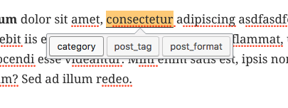

# TinyMCE Terms

Demo plugin, unpolished without specific purpose. May not even be a good idea.

Select text, click a button in the toolbar, then choose a taxonomy. The selected text will then be added as a category/tag/etc. for the given post.